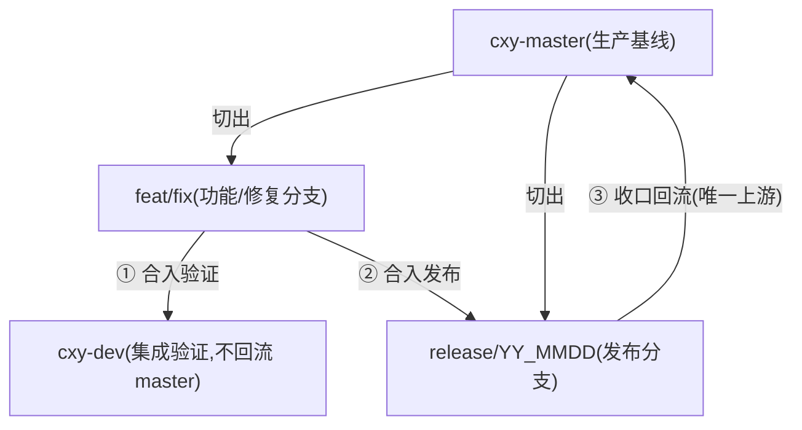
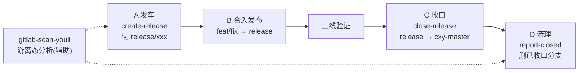

# GitLab 发布分支全流程规范

内网 GitLab CE 16.9.1,`http://172.16.168.245:28080`。认证统一用**账号密码**:环境变量 `GITLAB_USER` + `GITLAB_PASSWORD`,脚本先试 OAuth 密码授权拿 Bearer,失败退回 HTTP Basic。

**凭证获取与存储铁律(见下方「〇、凭证引导」)**:账号密码**只能存于 agent 记忆**,**严禁写入本技能目录任何文件**(SKILL.md / scripts/ / 模板)。项目清单、权限约束见项目 CLAUDE.md 与记忆(gitlab-project-groups / gitlab-constraints-no-delete-no-merge)。

## 〇、凭证引导(首次运行必须,之后从记忆读取)

本技能**不持有任何账号密码**。运行前必须先解决认证凭证,流程如下:

### 1. 判断记忆中是否已有凭证
- 检查 agent 记忆中是否存在键 `gitlab-credentials`(记录 `user` 与 `password`)。
- **已有** → 直接跳到第 3 步,从记忆读出后注入运行,**不要再次向用户索要**。
- **没有** → 执行第 2 步(首次引导)。

### 2. 首次运行:向用户索取并存入记忆(仅此一次)
- 用提问/对话明确索取两项:**GitLab 账号(用户名)** 与 **GitLab 密码**。
- 取得后**立即**写入 agent 记忆,键名建议 `gitlab-credentials`,内容形如:
  `user=<用户名>; password=<密码>`(仅此两条,不要存 host 以外的多余信息)。
- ⚠️ **严禁**把账号密码写进本技能目录任何文件(SKILL.md、scripts/ 下脚本、模板 docx 等)。记忆是唯一存储位置。

### 3. 后续每次运行:从记忆读取并注入脚本
- 从记忆读出 `user` / `password`,运行脚本时以**环境变量**注入,例如:
  ```bash
  GITLAB_USER=<记忆中的user> GITLAB_PASSWORD=<记忆中的password> \
    python3 gitlab-scan-youli.py --release release/YY_MMDD
  ```
- 也可用脚本参数 `--user` / `--password`(等效于环境变量,仍从记忆取值,不要硬编码)。
- 脚本 stderr 首行会打印 `[认证] 使用方式:OAuth-Bearer / HTTP-Basic`,据此确认认证生效。

### 4. 凭证失效处理
- 若运行报 401/403,提示用户密码可能已改;从记忆清除 `gitlab-credentials` 并重新走第 2 步引导。

## 一、分支模型(三分支模型)



- `cxy-dev` 即 dev,`cxy-master` 即 master;**二者永远平行,永不相交**(dev 上的内容只随 feat/fix 走 release 进生产,不直接回流 master)。
- feat/fix 完整生命周期:**cxy-master 切出 → 合 cxy-dev 验证 → 合 release 发布 → release 合回 cxy-master**。

## 二、铁律(违反即停,先报告用户)

1. **dev / 生产分支(release)/ master 永不相交**:release 上相对 cxy-dev 的差异**只允许是 merge commit**。若发现非 merge 的直接 commit(绕过 dev 直接提交在 release),必须停下来报告用户,不得擅自合。
2. **release 必须从 cxy-master 切**。从上一个 release 分支接着切,会把该分支未回流 master 的历史内容一并带入。
3. **合并一律 squash=false 标准合并**,保留原 SHA——squash/cherry-pick 重写 SHA 会让游离态 compare 全线误判。
4. **权限口径:只建不删不合**。批量建 MR/建分支可直接做;**accept 合并、删除分支必须用户逐次授权**,授权前先给清单让用户审。
5. 批量 accept 前遍历**全量仓**(自动发现,当前约 34 仓)的实时 open MR,不信早前快照(0909 漏 a2a-service !8 教训)。

## 三、场景与流程模型

**全链路总览**(一次发版的完整生命周期):



按场景组织:每个场景 = **流程模型**(长什么样、卡点在哪)→ **执行脚本**(怎么跑)。

### 场景 A:发车(创建 release 分支)

**流程模型**:

```
扫描候选分支(只读)
    ↓
输出候选清单(stdout 按仓分组 + Excel)
    ↓
⛔ 人工确认:哪些仓的哪些分支进本次 release
    ↓
按模块去重(一仓一 release,不管确认了几条分支)
    ↓
逐仓创建 release/xxx(基于 cxy-master)
    ↓
结果汇总(成功/已存在跳过/失败,仅 stdout)
```

**判定口径**:候选 = ①未收口(master=否)且 ≤28 天的 开发中/待发/上线验证中 ②已在 cxy-dev 的 feat/fix(时间老也列,标「老」)。已收口不列。

**执行脚本** — `gitlab-create-release.py`(两步式):

```bash
# 第一步(只读):出候选清单
python3 gitlab-create-release.py --release release/YY_MMDD --out-xlsx candidates.xlsx
# ⛔ 用户确认后,agent 组装 --branches
# 第二步(写):创建
python3 gitlab-create-release.py --release release/YY_MMDD \
    --branches "repoA:feat/x,feat/y;repoB:fix/z" --confirm
```

防呆:必须 `--confirm`;已存在跳过(幂等);单仓失败不中断。
辅助分析:跑 `gitlab-scan-youli.py --release release/YY_MMDD` 得游离态分类,「待发」即候选发布内容。

### 场景 B:合入发布(feat/fix → release)

**流程模型**:

```
对每个待发分支建 MR(source=feat/xxx, target=release/YY_MMDD, squash=false)
    ↓
⛔ 用户确认
    ↓
批量 accept(全量仓实时 open MR 列表,不信快照)
    ↓
逐个回读 state=merged 确认(偶发 405 是状态机窗口,回查 state 而非当失败)
```

**合入前核验(铁律 1)**:对每个 release 仓比对 `compare?from=cxy-dev&to=release/YY_MMDD`,差异中**非 merge commit 数必须为 0**;有直接 commit → 报告用户定夺(0909 案例用户可豁免,但必须先暴露)。

**执行方式**:暂无专用脚本,agent 按 SKILL.md 用 GitLab API 执行(建 MR 可直接做,accept 必须用户授权)。

### 场景 C:收口(release 上线后 → cxy-master)

**流程模型**:

```
release/xxx 上线验证通过
    ↓
① 逐仓 compare 预检:release 相对 cxy-master 有无差异
    (ahead=0 的仓跳过,无内容可合,broken_status 无意义)
    ↓
② 建 MR:source=release/xxx, target=cxy-master, squash=false
    ↓
③ ⛔ 用户授权(铁律4:accept 合并必须逐次授权,先给清单审)
    ↓
④ 批量 accept(遍历全量 34 仓实时 open MR,不信早前快照——0909 漏 a2a-service !8 的教训)
    ↓
⑤ 回读校验:compare?from=cxy-master&to=release/xxx = 0 commits
    → =0 即收口干净;≠0 说明有漏,报告用户
    ↓
⑥ 收口后的 release 分支可删(走场景 D 清理流程)
```

**执行脚本** — `gitlab-close-release.py`(两步式,②③④⑤ 已脚本化):

```bash
# 第一步(只读):出收口清单(每仓 ahead/open MR/状态)
python3 gitlab-close-release.py --release release/YY_MMDD --out-xlsx close-list.xlsx
# ⛔ 用户授权后执行
# 第二步(写):建 MR → accept → 回读校验 compare=0
python3 gitlab-close-release.py --release release/YY_MMDD --confirm
```

防呆:必须 `--confirm`;405 回查 state 再判;校验不过记失败。

### 场景 D:清理已收口分支

**流程模型**:

```
收口判定(feat/fix 三站标准)
    ①在 cxy-dev(compare dev→分支=0)
    ②进过 release
    ③在 cxy-master(compare master→分支=0)
    → 三站全过 = ✅可删;只到 master 没走 dev = ⚠️异常,保留并报告
    ↓
只读出待删清单
    ↓
⛔ 用户确认清单后授权
    ↓
执行删除(URL 编码 feat%2Fxxx;空 body=成功,必须 GET 复查 404)
    ↓
自动跳过有 open MR 的分支(删了 MR 会挂)
```

**release 收口标准**:release 合回 cxy-master 且 compare(master→release)=0,收口后即可删。

**执行脚本** — `gitlab-report-closed.py`(清理前的待删清单):

```bash
# 默认只读出报告(可安全删除的分支;异常分支单独列出保留)
python3 gitlab-report-closed.py --release release/YY_MMDD
# 确认后才执行删除
python3 gitlab-report-closed.py --release release/YY_MMDD --delete --confirm
```

范围约束:非本流程仓(skillhub 走 main 系、callcenter/enterprise/紫菁元不走 cxy 流程)**不纳入默认范围**,列出单独请示。

## 四、工具总览(scripts/ 目录,随技能分发)

| 场景 | 脚本 | 两步式开关 |
|---|---|---|
| A 发车切 release | `gitlab-create-release.py` | 扫描(不带 `--branches`)→ 创建(`--branches … --confirm`) |
| B 合入发布 | 暂无脚本,agent 按 API 执行 | — |
| C 收口合并 | `gitlab-close-release.py` | 扫描(不带 `--confirm`)→ 执行(`--confirm`) |
| D 清理分支 | `gitlab-report-closed.py` | 报告(默认只读)→ 删除(`--delete --confirm`) |
| 辅助:游离态分析 | `gitlab-scan-youli.py` | 报告(只读);`--list-merged`/`--delete-merged --confirm-delete` 清理已收口 |

所有脚本均为纯标准库(python3,无第三方依赖;`--out-xlsx` 需 openpyxl),跨环境通用:GitLab 地址用 `--host` 覆盖,认证读环境变量 `GITLAB_USER`+`GITLAB_PASSWORD`(账号密码,脚本自动走 OAuth/HTTP Basic),也可传 `--user/--password` 参数;仓库范围自动发现(扫 `MaaS` 组下 `default_branch=cxy-master` 的仓,别的 GitLab 实例换组名即可)。

### 报告输出铁律

单表原样输出(项目|分支|描述|三布尔|commit|提交人|分类),禁止拆表/删列/改名;优先直接引用脚本 stdout。Excel 给人核对,stdout 给 agent 读。

### 常见错误与处置

| 现象 | 原因 | 处置 |
|---|---|---|
| HTTP 401/403 | 凭证失效/权限不足 | 走「〇、凭证引导」第 4 步:清记忆重新引导;403 检查账号对该仓权限 |
| accept 返回 405 | MR 状态机窗口(刚建/状态变更中) | **不当失败**:等 2 秒回查 MR state,`merged` 即成功 |
| 建 MR 返回 409 | 同 source→target 的 MR 已存在 | 实时查 open MR 复用其 iid,继续 accept |
| 删除分支报 json 解析错 | GitLab CE 删除成功返回**空 body** | **空 body = 成功**:GET 分支复查 404 确认 |
| stdout 中文乱码 | Windows 控制台 GBK | 脚本已内置 `reconfigure(encoding="utf-8")`;agent 读 stdout 原样解析即可 |
| compare 返回空 | from/to 分支不存在 | 检查分支名;`default_branch` 非 cxy-master 的仓不在扫描范围 |

> ⚠️ 所有删除/accept 功能均不可逆;正式操作前先跑只读模式出清单给用户确认。

## 五、历史档案

release/26_0625、26_0812、26_0909 三次发布的完整记录与教训见记忆 `gitlab-release-iterations.md`。
